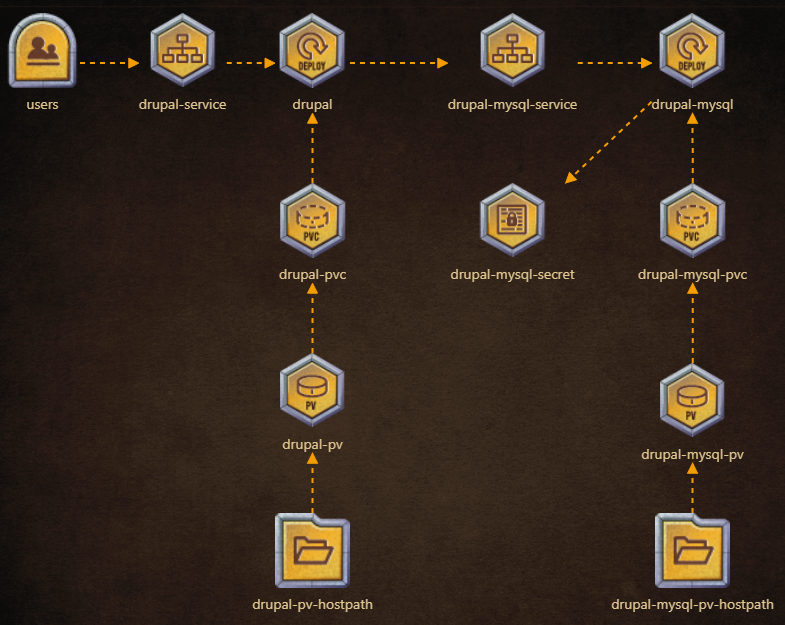

# Drupal - Bravo


You will receive a quest to deploy a web server architecture stack for a particular software distribution, for example: Drupal with MySQL.

Set up an example volume with storage allocation for the partition with the code:

Volume Name: drupal-mysql-pv
Storage: 5Gi
Access modes: ReadWriteOnce
In order to do this, Create the persistent storage volume for Drupal on the web server cluster using YAML:

```master $ cat > drupal-mysql-pv.yaml
---
apiVersion: v1
kind: PersistentVolume
metadata:
 name: drupal-mysql-pv
spec:
 accessModes: [ “ReadWriteOnce” ]
 capacity:
 storage: “5Gi”
 hostPath:
 path: /drupal-mysql-data
master $
```


In this challenge you will work with the following:

- [Deploy a Drupal application](https://kodekloud.com/courses/539883/lectures/9808165)
- [Configure Secrets](https://kodekloud.com/courses/539883/lectures/9808207)
- [Exposing application through Services](https://kodekloud.com/courses/539883/lectures/9808156)
- [Configure InitContainers on a POD](https://kodekloud.com/courses/539883/lectures/10589187)
- [Create Persistent Volumes and Persistent Volume Claims](https://kodekloud.com/courses/539883/lectures/9808276)

## Drupal-PV-Hostpath
- Configure drupal-pv with hostPath = /drupal-data (create the directory on Worker Nodes)

## Drupal-MySQL-PV-Hostpath
- Configure drupal-mysql-pv with hostPath = /drupal-mysql-data (create the directory on Worker Nodes)

## Drupal-PV
- Access modes: ReadWriteOnce
- Volume Name: drupal-pv
- Storage: 5Gi

## Drupal-MySQL-PV
- Volume Name: drupal-mysql-pv
- Storage: 5Gi
- Access modes: ReadWriteOnce

## Drupal-PVC
- Claim Name: drupal-pvc
- Storage Request: 5Gi
- Access modes: ReadWriteOnce

## Drupal-MySQL-PVC
- Claim Name: drupal-mysql-pvc
- Storage Request: 5Gi
- Access modes: ReadWriteOnce

## Drupal-MySQL-Secret
- Secret Name: drupal-mysql-secret
- Secret: MYSQL_ROOT_PASSWORD=root_password
- Secret: MYSQL_DATABASE=drupal-database

## Drupal-MySQL
- Name: drupal-mysql
- Replicas: 1
- Image: mysql:5.7
- Deployment Volume uses PVC : drupal-mysql-pvc
- Volume Mount Path: /var/lib/mysql, subPath: dbdata
- Deployment: 'drupal-mysql' running

## Drupal
- Deployment Name: drupal
- Replicas: 1
- Image: drupal:8.6
- Deployment has an initContainer, name: 'init-sites-volume'
- initContainer 'init-sites-volume', image: drupal:8.6
- initContainer 'init-sites-volume', persistentVolumeClaim: drupal-pvc
- initContainer 'init-sites-volume', mountPath: /data
- initContainer 'init-sites-volume', Command: [ "/bin/bash", "-c" ], initContainer: Args: [ 'cp -r /var/www/html/sites/ /data/; chown www-data:www-data /data/ -R' ]
- Deployment 'drupal' uses correct pvc: drupal-pvc
- Deployment has a regular container, name: 'drupal', image: 'drupal:8.6'
- container: 'drupal', Volume mountPath: /var/www/html/modules, subPath: modules
- container: 'drupal', Volume mountPath: /var/www/html/profiles, subPath: profiles
- container: 'drupal', Volume mountPath: /var/www/html/sites, subPath: sites
- container: 'drupal', Volume mountPath: /var/www/html/themes, subPath: themes
- Deployment: "drupal" running
- Deployment: 'drupal' has label 'app=drupal'

## Drupal-MySQL-Service
- Name: drupal-mysql-service
- Type: ClusterIP
- Port: 3306

## Drupal-Service
- frontend service name: drupal-service
- drupal-service configured as NodePort
- drupal-service uses NodePort 30095