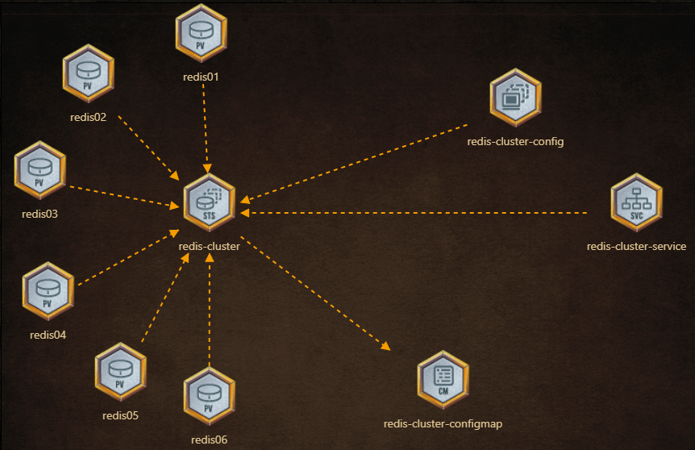

In this challenge you will work with the following:

- [Deploy a Redis HA Cluster](https://kodekloud.com/courses/539883/lectures/9808165)
- Deploy a StatefulSet
- [Deploy a Redis Service](https://kodekloud.com/courses/539883/lectures/9808156)
- [Create Persistent Volumes for the StatefulSet](https://kodekloud.com/courses/539883/lectures/9808276)
- [Add Commands to the Pod definition](https://kodekloud.com/courses/539883/lectures/9808202)
- Exec in to Redis Master pod to configure the cluster

---

## redis-cluster-configmap
- ConfigMap: redis-cluster-configmap is already created. Inspect it...

## redis01-06
- PersistentVolume - Name: redis01-06
- Access modes: ReadWriteOnce
- Size: 1Gi
- hostPath: /redis01-06, directory should be created on worker node

## redis-cluster
- StatefulSet - Name: redis-cluster
- Replicas: 6
- Pods status: Running (All 6 replicas)
- Image: redis:5.0.1-alpine
- container name: redis, command: ["/conf/update-node.sh", "redis-server", "/conf/redis.conf"]
- Env: name: 'POD_IP', valueFrom: 'fieldRef', fieldPath: 'status.podIP' (apiVersion: v1)
- Ports - name: 'client', containerPort: '6379'
- Ports - name: 'gossip', containerPort: '16379'
- Volume Mount - name: 'conf', mountPath: '/conf', readOnly:'false' (ConfigMap Mount)
- Volume Mount - name: 'conf', mountPath: '/conf', defaultMode = '0755' (ConfigMap Mount)
- Volume Mount - name: 'data', mountPath: '/data', readOnly:'false' (volumeClaim)
- volumes - name: 'conf', Type: 'ConfigMap', ConfigMap Name: 'redis-cluster-configmap',
- volumeClaimTemplates - name: 'data'
- volumeClaimTemplates - accessModes: 'ReadWriteOnce'
- volumeClaimTemplates - Storage Request: '1Gi'

## redis-cluster-service
- Ports - service name 'redis-cluster-service', port name: 'client', port: '6379'
- Ports - service name 'redis-cluster-service', port name: 'gossip', port: '16379'
- Ports - service name 'redis-cluster-service', port name: 'client', targetPort: '6379'
- Ports - service name 'redis-cluster-service', port name: 'gossip', targetPort: '16379'

## redis-cluster-config
- Configure the Cluster. Once the StatefulSet has been deployed with 6 'Running' pods, run the below commands and type 'yes' when prompted.
- Command: kubectl exec -it redis-cluster-0 -- redis-cli --cluster create --cluster-replicas 1 $(kubectl get pods -l app=redis-cluster -o jsonpath='{range.items[*]}{.status.podIP}:6379 ')