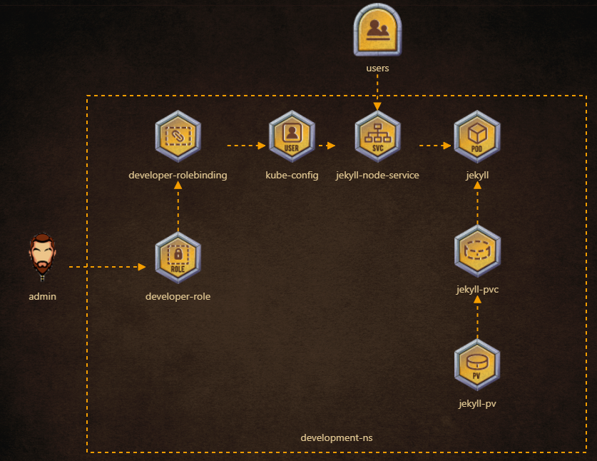

- [Deploy a Jekyll application](https://kodekloud.com/courses/539883/lectures/9808165)
- [Security: Configure Roles and RoleBindings](https://kodekloud.com/courses/539883/lectures/9808249)
- [Security: Configure KubeConfig](https://kodekloud.com/courses/539883/lectures/9808258)
- [Create Persistent Volumes and Persistent Volume Claims](https://kodekloud.com/courses/539883/lectures/9808276)

---

## admin

- Certificate and key pair for user drogo is created under /root. Add this user to kubeconfig = /root/.kube/config, User = drogo, client-key = /root/drogo.key client-certificate = /root/drogo.crt
- Create a new context in the default config file (/root/.kube/config) called 'developer' with user = drogo and cluster = kubernetes

## development-ns

- namspace called 'development' has already been created. Inspect it.

## development-role

- 'developer-role', should have all(*) permissions for services in development namespace
- 'developer-role', should have all permissions(*) for persistentvolumeclaims in development namespace
- 'developer-role', should have all(*) permissions for pods in development namespace

## developer-rolebinding

- create rolebinding = developer-rolebinding, role= 'developer-role', namespace = development
- rolebinding = developer-rolebinding associated with user = 'drogo'

## kube-config

- set context 'developer' with user = 'drogo' and cluster = 'kubernetes' as the current context.

## jekyll-pv

- jekyll-pv is already created. Inspect it before you create the pvc

## jekyll-pvc

- Storage Request: 1Gi
- Access modes: ReadWriteMany
- pvc name = jekyll-site, namespace development

## jekyll

- pod: 'jekyll' has an initContainer, name: 'copy-jekyll-site', image: 'kodekloud/jekyll'
- initContainer: 'copy-jekyll-site' command: [ "jekyll", "new", "/site" ] (command to run: jekyll new /site)
- pod: 'jekyll', initContainer: 'copy-jekyll-site', mountPath = /site
- pod: 'jekyll', initContainer: 'copy-jekyll-site', volume name = site
- pod: 'jekyll', container: 'jekyll', volume name = site
- pod: 'jekyll', container: 'jekyll', mountPath = /site
- pod: 'jekyll', container: 'jekyll', image = kodekloud/jekyll-serve
- pod: 'jekyll', uses volume called 'site' with pvc = 'jekyll-site'
- pod: 'jekyll' uses label 'run=jekyll'

## jekyll-node-service

- Service 'jekyll' uses targetPort: '4000' , namespace: 'development'
- Service 'jekyll' uses Port: '8080' , namespace: 'development'
- Service 'jekyll' uses NodePort: '30097' , namespace: 'development'